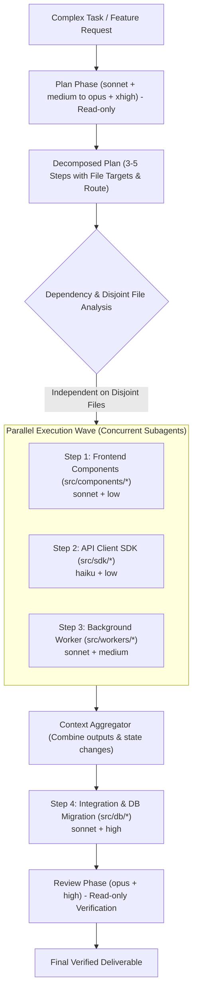
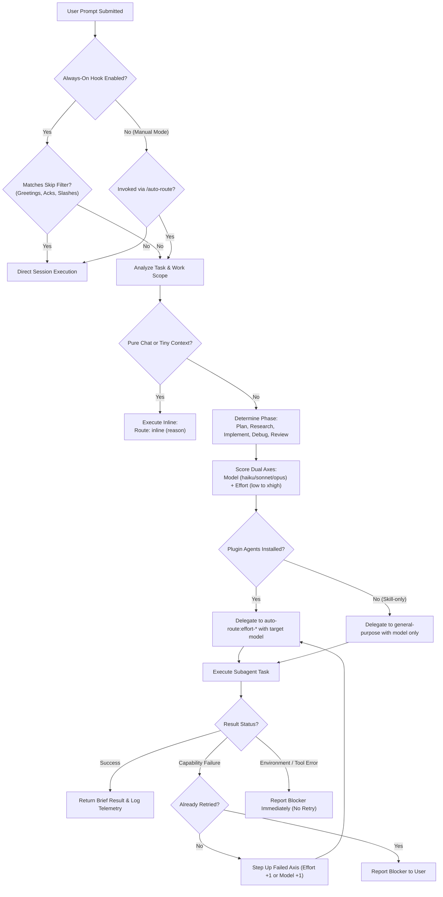

# auto-route

[](.claude-plugin/plugin.json)
[](LICENSE)
[](https://docs.anthropic.com/en/docs/agents-and-tools/claude-code/overview)
[](tests/)

**Smart dual-axis model & reasoning router with parallel subagent execution for Claude Code.**

`auto-route` automatically selects the optimal Claude model (`haiku`, `sonnet`, or `opus`) and reasoning effort (`low` to `xhigh`) for each task. It delegates work to isolated subagents, executes independent multi-step plan items in parallel, and runs pure conversational questions inline with zero overhead.

<details>
<summary><b>Table of Contents</b> (click to expand)</summary>

- [Overview](#overview)
- [Key Benefits](#key-benefits)
- [Quickstart (Install, Test, Uninstall)](#quickstart-install-test-uninstall)
  - [Installation](#installation)
  - [First Test Run](#first-test-run)
  - [Enable Always-On Mode](#enable-always-on-mode)
  - [Clean Uninstall](#clean-uninstall)
- [Usage & Command Reference](#usage--command-reference)
  - [Command Table](#command-table)
  - [Smart Filtering (Always-On Mode)](#smart-filtering-always-on-mode)
- [Parallel Subagent Execution](#parallel-subagent-execution)
  - [How Parallel Execution Works](#how-parallel-execution-works)
  - [Parallel Workflow Diagram](#parallel-workflow-diagram)
  - [Interactive Walkthrough: Parallel Plan](#interactive-walkthrough-parallel-plan)
- [How It Works (Under the Hood)](#how-it-works-under-the-hood)
  - [Decision & Routing Architecture](#decision--routing-architecture)
  - [Dual-Axis Routing Rubric](#dual-axis-routing-rubric)
  - [Phase Guidelines](#phase-guidelines)
  - [Adaptive Retries & Escalation](#adaptive-retries--escalation)
  - [Prompt Cache Preservation](#prompt-cache-preservation)
- [Cost Transparency: Real Pricing vs. Modeled Savings](#cost-transparency-real-pricing-vs-modeled-savings)
  - [1. Real Anthropic API Token Pricing](#1-real-anthropic-api-token-pricing)
  - [2. Modeled Scenario (Simulated 100-Task Workload)](#2-modeled-scenario-simulated-100-task-workload)
  - [3. Your Real Telemetry](#3-your-real-telemetry)
  - [Why Not Claude Fable?](#why-not-claude-fable)
- [Troubleshooting & FAQ](#troubleshooting--faq)
- [Contributing & Testing](#contributing--testing)
- [License](#license)

</details>

---

## Overview

By default, Claude Code runs every prompt with the primary session's active model and effort level. This means:
- Mechanical renames, regex changes, or simple grep searches burn expensive Opus tokens at maximum effort.
- Complex multi-file refactoring runs sequentially one step at a time.
- Toggling effort levels mid-session invalidates prompt caches.

`auto-route` solves this by classifying each task before delegating:

```text
> Rename variable 'clientSecret' to 'apiSecret' across auth services
Route: sonnet + low (mechanical rename across many files)
```

Pure chat inquiries and tiny contextual tasks run immediately inline with zero overhead:

```text
> What is the difference between TCP and UDP?
Route: inline (pure chat question)
TCP is connection-oriented and ensures reliable, ordered data delivery...
```

---

## Key Benefits

| Benefit | Without auto-route | With auto-route |
|---|---|---|
| **Optimized Costs** | Simple tasks run at full session rates (e.g. Opus rates for typo fixes). | Routes mechanical work to `haiku + low` and standard code to `sonnet + medium`, reserving `opus` for architecture and high judgment. |
| **Parallel Execution** | Multi-file tasks execute sequentially one by one in the main thread. | Independent plan steps across disjoint files execute concurrently across **parallel subagents**, cutting turnaround latency by up to 50%. |
| **Cache Preservation** | Changing reasoning effort mid-session invalidates the prompt cache and alters global settings ([issue #95347](https://github.com/anthropics/claude-code/issues/95347)). | Subagents run in isolated contexts with dedicated frontmatter effort levels, **keeping the main session cache warm**. |
| **Zero-Overhead Chat** | Pure questions either run unnecessarily through heavy pipelines or need manual switching. | Instantly detected and answered inline (`Route: inline`). |
| **Automated Escalation** | If an agent is underpowered, you must manually restart with higher params. | Automatically retries once on the deficient axis (`effort` or `model`). |

> [!TIP]
> **Minimal Token Footprint**: ~290 tokens per session (plugin registration), ~40 tokens per prompt (always-on hook), ~850 tokens on initial skill invoke (0 extra tokens on subsequent turns via session cache reuse), and ~70 tokens per launched subagent. Pure chat questions cost 0 extra tokens.

---

## Quickstart (Install, Test, Uninstall)

### Installation

Inside Claude Code:

```bash
/plugin marketplace add Sagor31h2/claude-auto-route
/plugin install auto-route@auto-route
```

*(Or from your terminal without the leading slash: `claude plugin marketplace add Sagor31h2/claude-auto-route && claude plugin install auto-route@auto-route`)*

> [!IMPORTANT]
> **Restart Claude Code** after installing to register the effort subagents and hooks into your session.

### First Test Run

Verify the installation by routing a single task on demand:

```text
/auto-route:auto-route Find where database connection pooling is configured
```

You will see the route decision line before the matching subagent runs:
```text
Route: haiku + low (symbol lookup in codebase)
```

### Enable Always-On Mode

To automatically route every prompt without typing the `/auto-route:auto-route` command prefix:

```text
/auto-route:auto-route on
```

Claude Code will confirm: `Auto-route: ON`. From then on, every eligible task is routed automatically.

### Clean Uninstall

If you ever wish to remove the plugin, you can uninstall it cleanly with no residual files left behind:

```bash
# 1. Uninstall the plugin inside Claude Code
/plugin uninstall auto-route@auto-route
```
```bash
# 2. (Optional) Remove local configuration flag and telemetry logs from terminal
rm -f ~/.claude/auto-route.on ~/.claude/auto-route.log ~/.claude/auto-route.stats
# If CLAUDE_CONFIG_DIR is set:
rm -f "${CLAUDE_CONFIG_DIR:-$HOME/.claude}/auto-route.on" "${CLAUDE_CONFIG_DIR:-$HOME/.claude}/auto-route.log" "${CLAUDE_CONFIG_DIR:-$HOME/.claude}/auto-route.stats"
```

---

## Usage & Command Reference

### Command Table

| Command | Action | Description |
|---|---|---|
| `/auto-route:auto-route <task>` | Route single task | Manually evaluates and routes a specific task. |
| `/auto-route:auto-route on` | Enable always-on | Creates flag file and routes every prompt automatically. |
| `/auto-route:auto-route off` | Disable always-on | Removes flag file, returning to manual routing mode. |
| `/auto-route:auto-route status` | Check status | Shows whether always-on mode is currently `ON` or `OFF`. |
| `/auto-route:auto-route stats` | View telemetry | Displays a compact table of runs, token usage, and durations (off by default; says so if disabled). |
| `/auto-route:auto-route stats on` | Enable stats logging | Creates flag file; each routed run is appended to `~/.claude/auto-route.log`. |
| `/auto-route:auto-route stats off` | Disable stats logging | Removes flag file; the log itself is kept. |
| `/auto-route:auto-route reset` | Reset stats | Clears `~/.claude/auto-route.log`. |

### Smart Filtering (Always-On Mode)

When always-on mode is active, the `UserPromptSubmit` hook prompts Claude to route tasks before running tools. To prevent annoying interruptions, it automatically skips:

- **Slash commands**: `/help`, `/exit`, `/compact`, `/plugin`, etc.
- **Acknowledgements**: `ok`, `okay`, `yes`, `yep`, `sure`, `continue`, `proceed`, `done`, `lgtm`, `looks good`.
- **Greetings & pleasantries**: `hi`, `hello`, `hey`, `good morning`, `thanks`, `thank you`, `bye`.
- **Cancellations**: `stop`, `cancel`, `wait`, `hold on`, `nevermind`.
- **Greeting-prefixed tasks**: `hi, please fix the bug in auth.py` $\rightarrow$ **Correctly identified as a task and routed!**

---

## Parallel Subagent Execution

### How Parallel Execution Works

When a task requires multiple steps across a codebase:
1. **Decomposition**: The **Plan** phase produces 3–5 coarse, actionable steps with designated file targets.
2. **Dependency & Disjoint Check**: Steps that are independent and modify disjoint files or directories are flagged for concurrent execution.
3. **Parallel Dispatch**: `auto-route` dispatches matching subagents simultaneously, each configured with its own optimal model and effort tier.
4. **Context Aggregation**: As subagents finish, their outputs and modifications are assembled in the orchestrator before dependent sequential steps run.

```text
Sequential Execution (Standard):
[Step 1: 30s] ────────> [Step 2: 25s] ────────> [Step 3: 35s] ────────> [Step 4: 20s] = 110s total

Parallel Execution (auto-route):
┌── [Step 1: Frontend Components (30s)] ──┐
├── [Step 2: API Client SDK (25s)] ───────┼──> [Aggregator] ──> [Step 4: DB Migration (20s)] = 50s total
└── [Step 3: Background Worker (35s)] ────┘
                                               ▲ Slashing latency by >50%
```

### Parallel Workflow Diagram



### Interactive Walkthrough: Parallel Plan

Here is what the terminal output looks like when parallel subagent execution runs:

```text
> Add webhooks support for invoice payments and update SDK and docs

Route: opus + effort-high (multi-file architecture and feature design)

[auto-route:effort-high subagent started with model: opus]
  Plan generated:
    Step 1: Webhook emitter & dispatcher (src/events/webhook.ts) -> sonnet + medium
    Step 2: Webhook payload types in SDK (sdk/types.ts)          -> haiku + low
    Step 3: Webhook schema documentation (docs/webhooks.md)      -> haiku + low
    Step 4: Connect payment processor (src/billing/invoice.ts)   -> sonnet + high (depends on Step 1)
    Step 5: Security review of webhook signing & HMAC validation -> opus + high
[Plan complete. Steps 1, 2, and 3 target disjoint files with no mutual dependencies.]

⚡ Dispatched parallel execution wave:
  ├── [Subagent 1: sonnet + medium] Working on src/events/webhook.ts ...
  ├── [Subagent 2: haiku + low]     Working on sdk/types.ts ...
  └── [Subagent 3: haiku + low]     Working on docs/webhooks.md ...

  ✓ Subagent 2 finished in 5.1s (420 tokens)
  ✓ Subagent 3 finished in 6.2s (610 tokens)
  ✓ Subagent 1 finished in 14.8s (1,850 tokens)

Dispatched sequential Step 4:
  [Subagent 4: sonnet + high] Wiring invoice.ts to webhook emitter ...
  ✓ Subagent 4 finished in 18.2s (2,410 tokens)

Dispatched final Review:
  [Subagent 5: opus + high (read-only)] Auditing HMAC signing and replay attack mitigations ...
  ✓ Verified: Constant-time comparison used for signature checks. No vulnerabilities detected.

Feature complete! Webhooks dispatcher, SDK types, documentation, and invoice wiring finished and reviewed.
```

---

## How It Works (Under the Hood)

### Decision & Routing Architecture



### Dual-Axis Routing Rubric

Tasks are evaluated on two orthogonal dimensions:

1. **Model Axis (Capability & Knowledge)**:
   - **`haiku`**: Mechanical, well-specified, small scope (typos, lookups, regex changes, running commands).
   - **`sonnet`**: Standard engineering workhorse (features, localized bugs, unit tests, explanations).
   - **`opus`**: High judgment, broad architectural scope (subsystem design, multi-file migrations, security analysis, unfamiliar domains).
   - **Never `fable`**: Excluded due to high pricing without granular per-turn reasoning controls.

2. **Effort Axis (Reasoning Depth)**:
   Claude Code configures effort via agent frontmatter. `auto-route` includes 5 pre-configured effort agents:

| Effort Level | Agent Name | Ideal For |
|---|---|---|
| `low` | `auto-route:effort-low` | Obvious changes once code is seen (typos, formatting, renames). |
| `medium` | `auto-route:effort-medium` | Standard multi-step changes (typical controller endpoints, component logic). |
| `high` | `auto-route:effort-high` | Tracing complex logic, unknown-cause bugs, cross-module flows. |
| `xhigh` | `auto-route:effort-xhigh` | Concurrency race conditions, distributed consistency, memory leaks. |
| `max` | `auto-route:effort-max` | Single retry reserved exclusively after `opus` + `effort-xhigh` falls short. |

> [!NOTE]
> **Skill-Only Fallback**: If installed via `npx skills add` without agent definitions, `auto-route` delegates to `subagent_type: general-purpose` with the target `model` specified, reporting:
> `Route: sonnet (effort not set: plugin agents missing)`. Full dual-axis routing requires the Claude Code plugin installation.

### Phase Guidelines

Work is partitioned into 5 discrete phases to ensure proper safety boundaries:

| Phase | Read-Only? | Typical Route Range | Purpose & Guidelines |
|---|:---:|---|---|
| **Plan** | Yes | `sonnet` + `medium` to `opus` + `xhigh` | Produces 3–5 coarse, actionable steps with What, Target Files, Dependencies, Route, and Done When. |
| **Research** | Yes | `haiku` + `low` to `sonnet` + `medium` | Finds definitions, inspects call hierarchies, verifies library APIs. Reports concrete `file:line` locations without edits. |
| **Implement** | No | Rubric-selected (usually `haiku` + `low` to `sonnet` + `high`) | Modifies files. Exactly one plan step per delegation. |
| **Debug** | No | `sonnet` + `high` to `opus` + `xhigh` | Isolates intermittent bugs and deadlocks. Requires establishing root cause before proposing fixes. |
| **Review** | Yes | `sonnet` + `medium` to `opus` + `high` | Audits code after risky or multi-file plans. Reports critical defects, correctness bugs, and security risks only. |

### Adaptive Retries & Escalation

- **Retry Budget**: At most **one retry** per task.
- **Capability Failures Only**: Triggered when a subagent produces an incomplete or uncertain solution.
- **Single-Axis Escalation**:
  - If reasoning fell short: Step up effort (`low` $\rightarrow$ `medium` $\rightarrow$ `high` $\rightarrow$ `xhigh`).
  - If capability fell short: Step up model (`haiku` $\rightarrow$ `sonnet` $\rightarrow$ `opus`).
- **No Retries on Environment Errors**: Missing files, permission errors, shell syntax errors, and tool failures are reported directly to the user to avoid wasting tokens.

### Prompt Cache Preservation

Why route through subagents instead of changing `effortLevel` inside the primary conversation?

1. **Anthropic Cache Keys**: Reasoning effort is part of the API prompt cache key. Switching effort levels mid-conversation invalidates the prompt cache and forces a cold re-read of entire conversation history.
2. **Global Setting Pollution**: Claude Code reads `effortLevel` globally from `~/.claude/settings.json`. Modifying it mid-session alters settings for all open sessions on the machine ([issue #95347](https://github.com/anthropics/claude-code/issues/95347)).
3. **Subagent Isolation**: Subagents run with isolated context windows and fixed frontmatter effort levels, preserving the primary session's cache state.

---

## Cost Transparency: Real Pricing vs. Modeled Savings

### 1. Real Anthropic API Token Pricing

These are the official Anthropic API list prices per million tokens:

| Model | Input / 1M Tokens | Output / 1M Tokens | Cache Read / 1M Tokens |
|---|:---:|:---:|:---:|
| **Claude 3.5 Haiku** | **$0.80** | **$4.00** | **$0.08** |
| **Claude 3.7 Sonnet** | **$3.00** | **$15.00** | **$0.30** |
| **Claude Opus 5.5** | **$4.00** | **$20.00** | **$0.40** |
| *Claude Fable* | *$10.00* | *$50.00* | *$1.25* |

*(Source: [Anthropic Pricing Documentation](https://platform.claude.com/docs/en/about-claude/pricing))*

### 2. Modeled Scenario (Simulated 100-Task Workload)

> [!NOTE]
> **Illustrative Simulation Notice**: The table below represents a **modeled scenario** based on estimated token volumes across a hypothetical distribution of 100 development tasks. It demonstrates how routing tasks away from a flat Opus baseline produces structural savings. Actual savings will vary based on your specific prompts and workflow.

| Task Category | Volume | Unmanaged Baseline | `auto-route` Selection | Baseline Cost (Est.) | Auto-Route Cost (Est.) | Estimated Savings |
|---|:---:|---|---|:---:|:---:|:---:|
| **Quick Lookups / Typos / Tests** | 40 tasks | `opus + high` ($0.12/task) | `haiku + low` ($0.006/task) | $4.80 | $0.24 | **-95%** |
| **Localized Features / Unit Tests** | 40 tasks | `opus + high` ($0.14/task) | `sonnet + medium` ($0.045/task) | $5.60 | $1.80 | **-68%** |
| **Tricky Debugging / Refactoring** | 15 tasks | `opus + high` ($0.18/task) | `sonnet + high` ($0.085/task) | $2.70 | $1.28 | **-53%** |
| **Architecture Plans & Deep Reviews** | 5 tasks | `opus + high` ($0.26/task) | `opus + xhigh` ($0.28/task) | $1.30 | $1.40 | +8% |
| **TOTALS** | **100 tasks** | **Flat Opus Usage** | **Dynamic Dual-Axis Routing** | **$14.40** | **$4.72** | **~67% Estimated Savings** |

### 3. Your Real Telemetry

Stats logging is **off by default**, **100% offline**, and purely local — nothing ever leaves your machine. Enable it anytime with:

```text
/auto-route:auto-route stats on
```

Then run `/auto-route:auto-route stats` to inspect your **actual measured token consumption and runtimes**. Once enabled, the plugin logs real usage from subagent transcripts into `~/.claude/auto-route.log` after each run and displays a summary table:

```text
Route           Runs      Tokens        Avg Duration
haiku + low     18 runs   24,190 tokens    4s avg
sonnet + low    12 runs   18,400 tokens    9s avg
sonnet + medium 24 runs   64,280 tokens   18s avg
sonnet + high    8 runs   32,150 tokens   42s avg
opus + high      3 runs   19,800 tokens   65s avg
opus + xhigh     1 runs   12,400 tokens  110s avg
```

### Why Not Claude Fable?

Claude Fable is billed at $10 / $50 per million input/output tokens—2.5× the cost of Opus 5.5—while offering equivalent or lower coding benchmark performance and lacking granular per-turn reasoning controls. `auto-route` explicitly avoids routing to Fable.

---

## Troubleshooting & FAQ

### Prompt runs inline instead of delegating
- Always-on mode directs pure chat inquiries and tiny contextual tasks to run inline to avoid subagent spin-up latency and token overhead.
- To force delegation, call directly: `/auto-route:auto-route <your task>`.

### Always-on mode appears inactive
- Verify the flag file exists: `cat ~/.claude/auto-route.on` (or check `/auto-route:auto-route status`).
- Verify that `jq` is installed on your system PATH (`command -v jq`). The hooks require `jq` to parse input JSON.

### Local code changes are not reflected
- Running Claude Code sessions cache plugins in `~/.claude/plugins/cache/auto-route/auto-route/<version>`.
- Update the plugin and restart Claude Code:
  ```bash
  claude plugin update auto-route@auto-route
  ```

### No statistics logged
- Stats logging is off by default. Enable it with `/auto-route:auto-route stats on`.
- Telemetry requires `jq`. If `jq` is missing, hooks exit without logging.
- Check permissions on `~/.claude/auto-route.log`.

---

## Contributing & Testing

Contributions and test improvements are welcome!

### Running the Test Suite

Run the automated test harnesses (requires `bash` and `jq`):

```bash
bash tests/always-on.test.sh
bash tests/log-route.test.sh
bash tests/manage.test.sh
```

### Validating the Plugin Manifest

```bash
claude plugin validate .
```

### Running Evals

```bash
claude plugin eval . --runs 1 --ablation none --scaffold --trust-plugin --no-publish
```

### Repository Layout

```text
.
├── .claude-plugin/
│   └── plugin.json                 # Manifest, hooks registration, version
├── agents/                         # Effort subagent definitions
│   ├── effort-low.md               # effort: low, model: inherit
│   ├── effort-medium.md            # effort: medium, model: inherit
│   ├── effort-high.md              # effort: high, model: inherit
│   ├── effort-xhigh.md             # effort: xhigh, model: inherit
│   └── effort-max.md               # effort: max, model: inherit (retry only)
├── hooks/
│   ├── always-on.sh                # UserPromptSubmit hook for prompt routing
│   └── log-route.sh                # SubagentStop hook for transcript telemetry
├── skills/
│   └── auto-route/
│       ├── SKILL.md                # Core router prompt & rubric logic
│       ├── manage.sh               # Deterministic admin command handler
│       └── stats.sh                # Telemetry aggregator script
├── tests/
│   ├── always-on.test.sh           # Test suite for skip patterns and triggers
│   ├── log-route.test.sh           # Test suite for transcript log aggregation
│   └── manage.test.sh              # Test suite for admin command management
├── evals/                          # Evaluation benchmarks
├── LICENSE                         # MIT License
└── README.md                       # Documentation
```

---

## License

MIT © [sagor](https://github.com/Sagor31h2)
